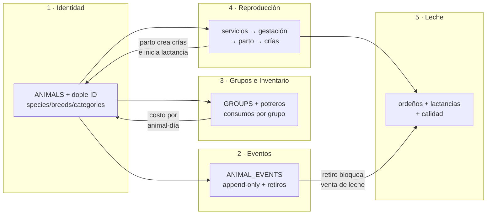
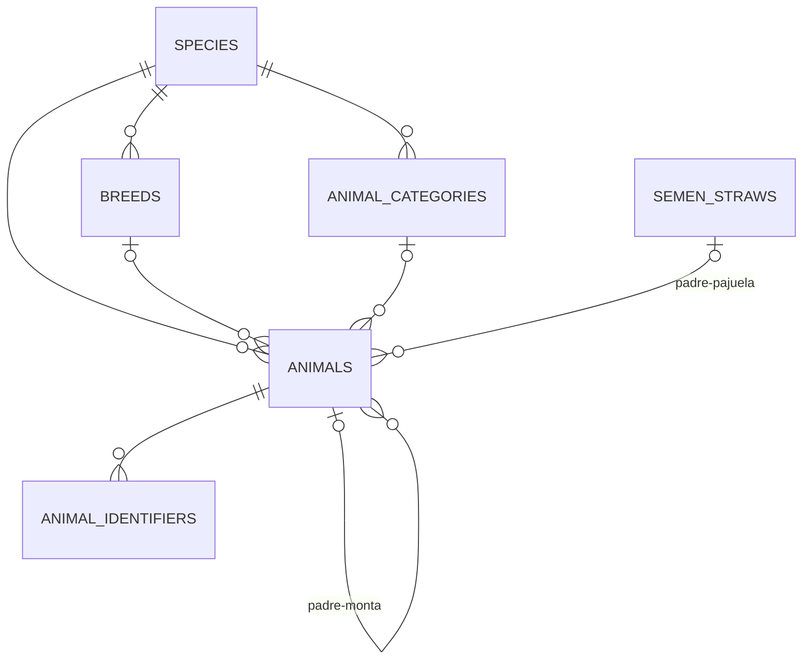
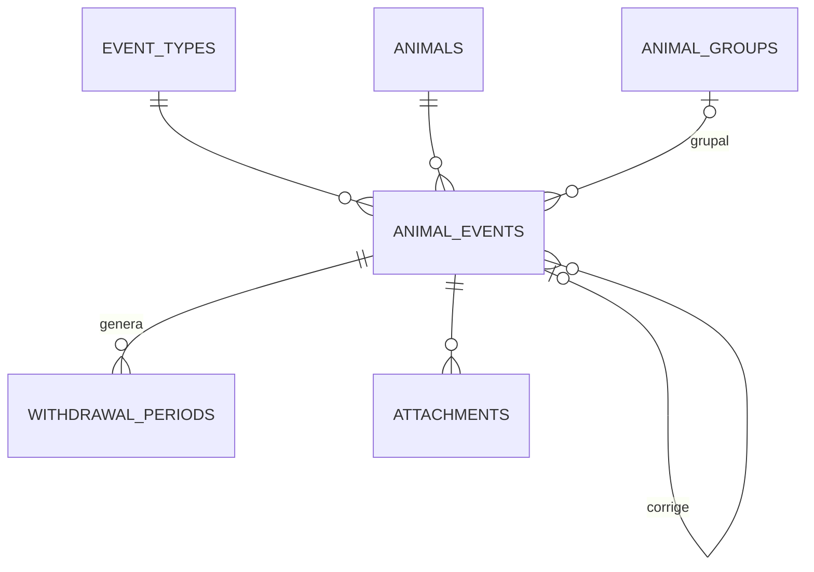
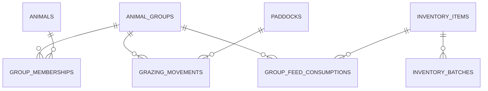
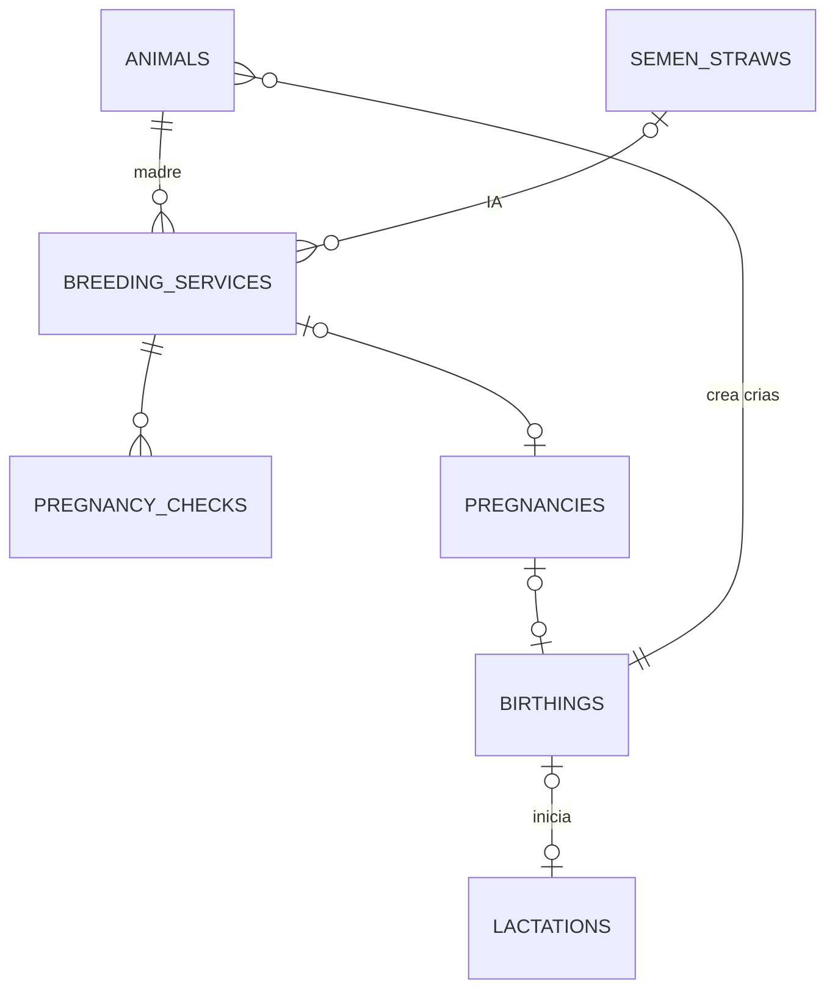
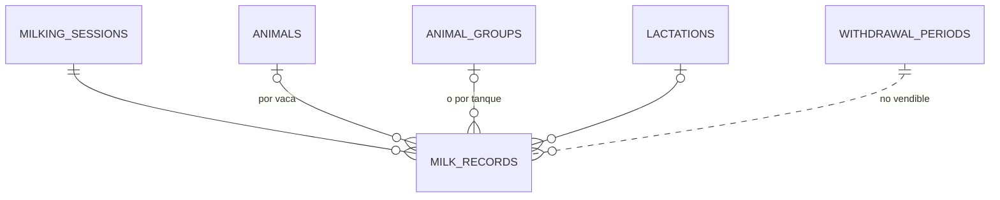

# DATA-MODEL.md — Modelo de datos del core (Fases 1–2)

> **Alcance deliberado:** este documento modela el **core** — identidad, eventos, grupos,
> inventario básico, reproducción y leche. Ventas, compras, contabilidad, transformación
> (BOM) y RRHH se diagramarán **al iniciar su fase** (Art. 11 del CONSTITUTION.md):
> diseñarlas hoy garantiza retrabajo. Aquí solo dejamos sus *ganchos* de extensión.
>
> Los diagramas están en Mermaid: GitHub y la mayoría de IDEs los renderizan nativamente.
> PostgreSQL: nombres `snake_case`, PKs `uuid`, dinero `numeric` (decimal), fechas de
> negocio `date`, timestamps `timestamptz` en UTC. Todo con `created_at` y borrado lógico
> (`deleted_at`) — se omiten de algunos diagramas por legibilidad, pero son universales.

---

## Vista de conjunto (cómo se conectan los 5 núcleos)

---

## Núcleo 1 — Identidad: animal genérico + doble identificación

*(diagrama completo: `der-1-identidad.mermaid`)*

**Decisiones clave**

- `animals.id` es UUID interno **soberano** (ADR-0006), generable offline. Los IDs externos
  viven en `animal_identifiers` con vigencia temporal (`valid_from`/`valid_to`): soporta
  animales sin arete, SIFAE tardío, aretes reemplazados y ventas pre-registro.
- **Padre dual**: `father_animal_id` XOR `father_straw_id` (constraint CHECK: como máximo
  uno no-nulo). El árbol genealógico no se rompe cuando el padre es una pajuela de catálogo.
- `species.gestation_days` y los días de retiro por defecto son **parámetros en datos**
  (Art. 8) — agregar equinos o cuyes es un INSERT, no un deploy.
- `animals.category_id` es la etapa *actual* (ternera → vacona → vaca); el historial de
  cambios de categoría queda como eventos (`MovementEvent`/`CategoryChangeEvent`).

**Invariantes a implementar** (dominio + constraints):
un animal no puede ser su propio ancestro (validar al asignar madre/padre) · `sex` coherente
con roles reproductivos · un solo identificador *vigente* por tipo y animal (índice único
parcial `WHERE valid_to IS NULL`).

---

## Núcleo 2 — Eventos: el corazón del sistema

*(diagrama completo: `der-2-eventos.mermaid`)*

**Decisiones clave** (ADR-0004)

- `animal_events` es **append-only**: sin UPDATE ni DELETE (revocar permisos a nivel de BD
  además del código). Errores → evento de corrección con `corrects_event_id`.
- `payload JSONB` tipado por `event_types.payload_schema` (validado en Application con
  FluentValidation; el esquema en BD documenta y permite validación adicional).
  Ejemplos de payload:
  - *treatment*: `{item_id, batch_id, product_name, dose, dose_unit, route, vet, reason}`
  - *weighing*: `{weight_kg, method}`
  - *movement*: `{from_group_id, to_group_id}` o `{to_paddock_id}`
  - *disposal*: `{reason: venta|muerte|robo, cause, sale_ref}`
- Eventos **grupales** (vacunar todo el lote): un evento con `group_id`; el sistema puede
  materializarlo por animal o resolverlo en consulta — decidir en implementación, empezar
  simple (evento grupal + expansión en consulta).
- `withdrawal_periods` se crea automáticamente al registrar un tratamiento cuyo
  medicamento (ítem de inventario) tenga días de retiro. **Regla bloqueante**: Producción
  la consulta para marcar leche no-vendible; Ventas (Fase 4) la consultará para bloquear.
- `occurred_at` ≠ `recorded_at`: en el campo se registra tarde; ambos importan.

**Índices**: `(animal_id, occurred_at DESC)` — la consulta reina es "el expediente" ·
GIN sobre `payload` solo cuando una consulta real lo pida · `(event_type_id, occurred_at)`.

---

## Núcleo 3 — Grupos, potreros e inventario (el costeo vive aquí)

*(diagrama completo: `der-3-grupos-inventario.mermaid`)*

**Decisiones clave**

- La membresía animal↔grupo es **temporal** (`from_date`/`to_date`): permite calcular
  *animal-días* por grupo en cualquier período, que es la base del prorrateo:
  `costo_animal_día = Σ costos del grupo en el período ÷ Σ animal-días`.
- El consumo de alimento se registra **al grupo, jamás por animal** ("¿cuánto pienso comí,
  cerdo #47?" no existe en una finca real). `total_cost` congela el costo del día para que
  cambios de precio futuros no reescriban historia.
- `inventory_batches` con vencimiento → alertas (Fase 2) y salida FEFO (primero lo que
  primero expira). Los medicamentos llevan sus días de retiro por defecto en el ítem.
- `unit_conversions` evita el clásico bug del saco: se compra en `saco45kg`, se consume
  en `kg`.
- Un animal puede estar en **un solo grupo a la vez** (índice único parcial sobre
  `group_memberships WHERE to_date IS NULL`). Si algún día se necesitan pertenencias
  simultáneas (grupo de manejo + grupo sanitario), se relaja con ADR.

---

## Núcleo 4 — Reproducción y genética (Fase 2, pero las FKs nacen en Fase 1)

*(diagrama completo: `der-4-reproduccion.mermaid`)*

**Decisiones clave**

- La cadena completa: `breeding_services` → `pregnancy_checks` → `pregnancies` (con
  `expected_birth_date = service_date + species.gestation_days` → alerta de parto próximo)
  → `birthings` → crías creadas como `animals` con `mother_id`, padre resuelto desde el
  servicio, y `birthing_id`.
- `birthings` modela **camada** (total, vivos, muertos, momias): en vacas casi siempre 1,
  en cerdas es EL dato. Mismo modelo para ambas — cero código por especie.
- Los KPI de "buena madre" **no se almacenan: se derivan** (intervalo entre partos, días
  abiertos, servicios/concepción, destetados/año) — vistas o consultas, materializadas
  solo si el rendimiento lo pide.
- Árbol genealógico = CTE recursiva sobre `animals(mother_id, father_animal_id,
  father_straw_id)`. Límite de profundidad en la consulta (p. ej. 6 generaciones).
- El destete es un `AnimalEvent` (cierra el ciclo madre-cría), no una tabla propia.

---

## Núcleo 5 — Producción de leche

*(diagrama completo: `der-5-produccion-leche.mermaid`)*

**Decisiones clave**

- Registro **flexible**: por vaca (`animal_id`) o por grupo/tanque (`group_id`) — muchas
  fincas empiezan midiendo el tanque y luego individualizan. CHECK: exactamente uno de los
  dos no-nulo.
- `lactation_id` se resuelve automáticamente (la lactancia activa de esa vaca); permite
  curvas de lactancia y comparación entre lactancias — el análisis lechero serio.
- `is_sellable = false` + `withdrawal_period_id` cuando la vaca está en retiro: **la leche
  se registra igual** (la producción es real) pero queda marcada; el total vendible del día
  excluye esos litros. Ventas (Fase 4) heredará esta regla ya operativa.
- `milk_quality_tests` con `results JSONB` por tipo de prueba (CMT por cuarto, células
  somáticas, sólidos…) — en Fase 4/5 conectará con el precio de la procesadora.

---

## Ganchos de extensión (por qué el core no se reescribirá)

| Futuro (fase) | Gancho ya presente en el core |
|---|---|
| Ventas de leche/animales (F4) | `disposal` como evento + `is_sellable`/retiros operativos + `attachments` para guías |
| Compras y proveedores (F4) | `supplier_name` en batches/pajuelas se promociona a FK `suppliers` con una migración trivial |
| Contabilidad (F4) | todo evento/consumo lleva costo → los asientos se emiten desde datos ya capturados |
| Transformación/BOM (F5) | `inventory_items.item_type` ya admite `product`; la BOM consume/produce ítems existentes |
| Turismo (F7+) | bounded context nuevo; solo compartirá `users`/contabilidad — cero impacto aquí |
| IA/analítica (F6) | la serie temporal completa vive en `animal_events` + `milk_records` |
| Sync móvil (F3) | UUIDs cliente + `sync_source` + append-only ⇒ conflictos mínimos por diseño |

## Reglas transversales del esquema

1. **Sin DELETE físico** en ninguna tabla de negocio; sin UPDATE en `animal_events`.
2. **Auditoría universal**: `created_at`, `created_by` (y `updated_at`/`updated_by` donde
   aplique) en todas las tablas.
3. **Catálogos configurables** (`species`, `breeds`, `categories`, `event_types`, `units`)
   se administran desde el panel, nunca se hardcodean.
4. Constraints XOR documentados: padre del animal, destino del `milk_record`.
5. Migraciones EF Core desde el día uno; este documento se actualiza **en el mismo PR**
   que cambie el esquema.

## Qué NO está aquí (a propósito)

`sales`, `purchases`, `suppliers`, `customers`, `journal_entries`, `cost_centers`,
`bill_of_materials`, `transformation_orders`, `employees` (nómina completa), `tasks/alerts`
(motor de reglas), `machinery`. Cada uno se diagramará al abrir su fase, sobre la realidad
que el core ya habrá revelado.
