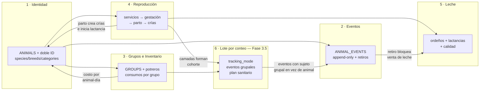
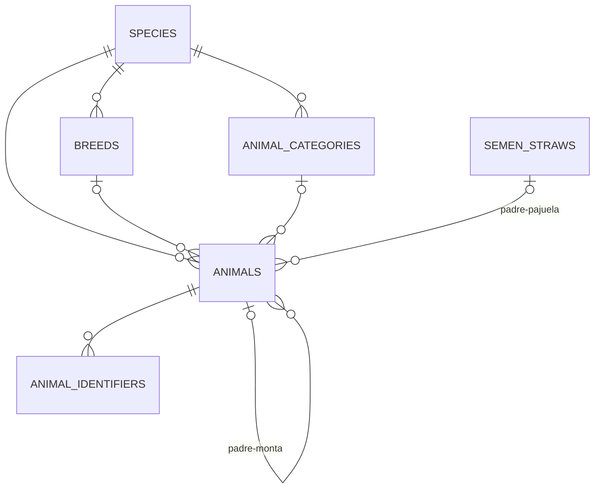
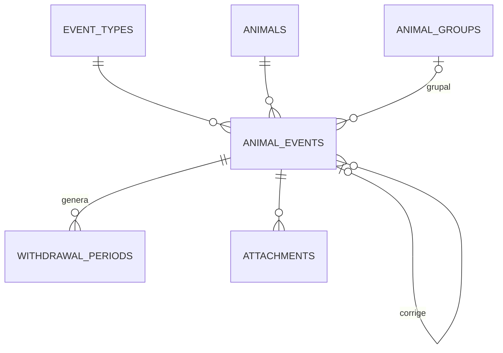
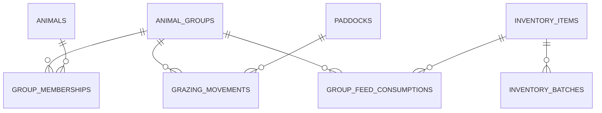
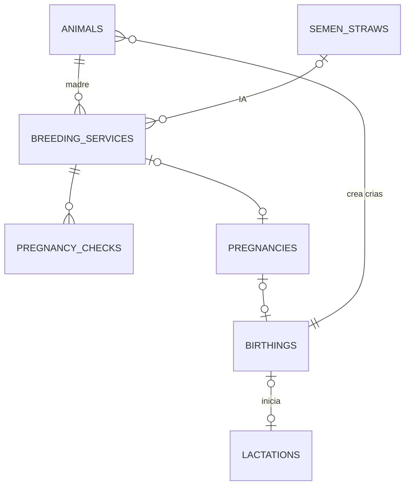
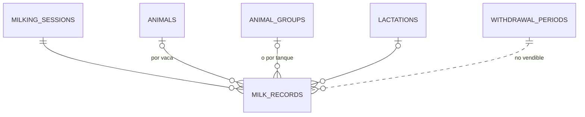
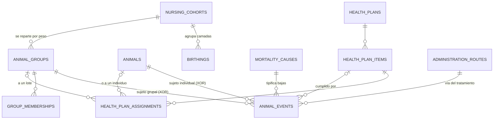
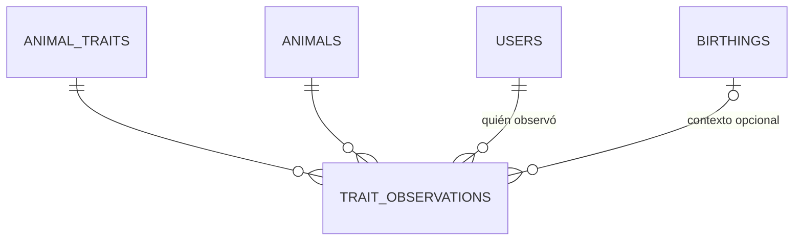

# DATA-MODEL.md — Modelo de datos del core (Fases 1–2, + Núcleo 6 en Fase 3.5)

> **Alcance deliberado:** este documento modela el **core** — identidad, eventos, grupos,
> inventario básico, reproducción y leche. Ventas, compras, contabilidad, transformación
> (BOM) y RRHH se diagramarán **al iniciar su fase** (Art. 11 del CONSTITUTION.md):
> diseñarlas hoy garantiza retrabajo. Aquí solo dejamos sus *ganchos* de extensión.
>
> Los Núcleos 1–5 están **implementados**. El **Núcleo 6** (manejo por lote sin
> identificación individual, Fase 3.5) está **diseñado y no construido**: se documenta
> antes de tocar el esquema, y sus decisiones de fondo viven en los ADR-0015/0016/0017/0018.
>
> Los diagramas están en Mermaid: GitHub y la mayoría de IDEs los renderizan nativamente.
> PostgreSQL: nombres `snake_case`, PKs `uuid`, dinero `numeric` (decimal), fechas de
> negocio `date`, timestamps `timestamptz` en UTC. Todo con `created_at` y borrado lógico
> (`deleted_at`) — se omiten de algunos diagramas por legibilidad, pero son universales.

---

## Vista de conjunto (cómo se conectan los 5 núcleos)

---

## Núcleo 1 — Identidad: animal genérico + doble identificación

*(diagrama completo: `diagramas/der-1-identidad.mermaid`)*

**Decisiones clave**

- `animals.id` es UUID interno **soberano** (ADR-0006), generable offline. Los IDs externos
  viven en `animal_identifiers` con vigencia temporal (`valid_from`/`valid_to`): soporta
  animales sin arete, SIFAE tardío, aretes reemplazados y ventas pre-registro.
- **Padre dual**: `father_animal_id` XOR `father_straw_id` (constraint CHECK: como máximo
  uno no-nulo). El árbol genealógico no se rompe cuando el padre es una pajuela de catálogo.
- `species.gestation_days` y los días de retiro por defecto son **parámetros en datos**
  (Art. 8) — agregar equinos o cuyes es un INSERT, no un deploy.
- `animals.category_id` es la etapa *actual* (ternera → vacona → vaca); el historial de
  cambios de categoría queda como eventos (`MovementEvent`/`CategoryChangeEvent`).

**Invariantes a implementar** (dominio + constraints):
un animal no puede ser su propio ancestro (validar al asignar madre/padre) · `sex` coherente
con roles reproductivos · un solo identificador *vigente* por tipo y animal (índice único
parcial `WHERE valid_to IS NULL`).

---

## Núcleo 2 — Eventos: el corazón del sistema

*(diagrama completo: `diagramas/der-2-eventos.mermaid`)*

**Decisiones clave** (ADR-0004)

- `animal_events` es **append-only**: sin UPDATE ni DELETE (revocar permisos a nivel de BD
  además del código). Errores → evento de corrección con `corrects_event_id`.
- `payload JSONB` tipado por `event_types.payload_schema` (validado en Application con
  FluentValidation; el esquema en BD documenta y permite validación adicional).
  Ejemplos de payload:
  - *treatment*: `{item_id, batch_id, product_name, dose, dose_unit, route, vet, reason}`
  - *weighing*: `{weight_kg, method}`
  - *movement*: `{from_group_id, to_group_id}` o `{to_paddock_id}`
  - *disposal*: `{reason: venta|muerte|robo, cause, sale_ref}`
- Eventos **grupales** (vacunar todo el lote): un evento con `group_id`; el sistema puede
  materializarlo por animal o resolverlo en consulta — decidir en implementación, empezar
  simple (evento grupal + expansión en consulta).
  > **Estado (2026-08-05):** sigue **sin implementar**. `AnimalEvent.Create` exige hoy
  > `animal_id` no vacío (`AnimalEvent.cs:58`), así que no hay forma de registrar un hecho
  > de lote. **ADR-0015** lo ejecuta en Fase 3.5a respetando la decisión ya tomada arriba
  > (sin materializar por animal) y agrega el CHECK XOR `animal_id` / `group_id`. Ver
  > Núcleo 6.
- `withdrawal_periods` se crea automáticamente al registrar un tratamiento cuyo
  medicamento (ítem de inventario) tenga días de retiro. **Regla bloqueante**: Producción
  la consulta para marcar leche no-vendible; Ventas (Fase 4) la consultará para bloquear.
- `occurred_at` ≠ `recorded_at`: en el campo se registra tarde; ambos importan.

**Índices**: `(animal_id, occurred_at DESC)` — la consulta reina es "el expediente" ·
GIN sobre `payload` solo cuando una consulta real lo pida · `(event_type_id, occurred_at)`.

---

## Núcleo 3 — Grupos, potreros e inventario (el costeo vive aquí)

*(diagrama completo: `diagramas/der-3-grupos-inventario.mermaid`)*

**Decisiones clave**

- La membresía animal↔grupo es **temporal** (`from_date`/`to_date`): permite calcular
  *animal-días* por grupo en cualquier período, que es la base del prorrateo:
  `costo_animal_día = Σ costos del grupo en el período ÷ Σ animal-días`.
- El consumo de alimento se registra **al grupo, jamás por animal** ("¿cuánto pienso comí,
  cerdo #47?" no existe en una finca real). `total_cost` congela el costo del día para que
  cambios de precio futuros no reescriban historia.
- `inventory_batches` con vencimiento → alertas (Fase 2) y salida FEFO (primero lo que
  primero expira). Los medicamentos llevan sus días de retiro por defecto en el ítem.
- `unit_conversions` evita el clásico bug del saco: se compra en `saco45kg`, se consume
  en `kg`.
  > **Estado (2026-08-05):** **sin implementar**. `InventoryItem` tiene una sola `Unit`
  > (`InventoryItem.cs`) y no existe ninguna tabla de conversiones — el bug que este punto
  > anticipaba está vivo. El engorde porcino lo vuelve bloqueante: se compra en sacos de
  > 20/40 kg y se consume en kg. Entra en Fase 3.5a junto con `feed_stage`. Ver Núcleo 6.
- Un animal puede estar en **un solo grupo a la vez** (índice único parcial sobre
  `group_memberships WHERE to_date IS NULL`). Si algún día se necesitan pertenencias
  simultáneas (grupo de manejo + grupo sanitario), se relaja con ADR.

---

## Núcleo 4 — Reproducción y genética (Fase 2, pero las FKs nacen en Fase 1)

*(diagrama completo: `diagramas/der-4-reproduccion.mermaid`)*

**Decisiones clave**

- La cadena completa: `breeding_services` → `pregnancy_checks` → `pregnancies` (con
  `expected_birth_date = service_date + species.gestation_days` → alerta de parto próximo)
  → `birthings` → crías creadas como `animals` con `mother_id`, padre resuelto desde el
  servicio, y `birthing_id`.
- `birthings` modela **camada** (total, vivos, muertos, momias): en vacas casi siempre 1,
  en cerdas es EL dato. Mismo modelo para ambas — cero código por especie.
- Los KPI de "buena madre" **no se almacenan: se derivan** (intervalo entre partos, días
  abiertos, servicios/concepción, destetados/año) — vistas o consultas, materializadas
  solo si el rendimiento lo pide.
- Árbol genealógico = CTE recursiva sobre `animals(mother_id, father_animal_id,
  father_straw_id)`. Límite de profundidad en la consulta (p. ej. 6 generaciones).
- El destete es un `AnimalEvent` (cierra el ciclo madre-cría), no una tabla propia.

---

## Núcleo 5 — Producción de leche

*(diagrama completo: `diagramas/der-5-produccion-leche.mermaid`)*

**Decisiones clave**

- Registro **flexible**: por vaca (`animal_id`) o por grupo/tanque (`group_id`) — muchas
  fincas empiezan midiendo el tanque y luego individualizan. CHECK: exactamente uno de los
  dos no-nulo.
- `lactation_id` se resuelve automáticamente (la lactancia activa de esa vaca); permite
  curvas de lactancia y comparación entre lactancias — el análisis lechero serio.
- `is_sellable = false` + `withdrawal_period_id` cuando la vaca está en retiro: **la leche
  se registra igual** (la producción es real) pero queda marcada; el total vendible del día
  excluye esos litros. Ventas (Fase 4) heredará esta regla ya operativa.
- `milk_quality_tests` con `results JSONB` por tipo de prueba (CMT por cuarto, células
  somáticas, sólidos…) — en Fase 4/5 conectará con el precio de la procesadora.

---

---

## Núcleo 6 — Manejo por lote sin identificación individual (Fase 3.5)

> **Alcance:** este núcleo nace del pivote a porcinos (2026-08-05) y **nada de esto está
> implementado**. Se documenta antes de construir, según el Art. 15 y la regla 5 de este
> archivo. Decisiones de fondo en **ADR-0015** (lote por conteo), **ADR-0016** (plan
> sanitario), **ADR-0017** (corrección de campo) y **ADR-0018** (características
> observables — el único **transversal a todas las especies**: nace acá pero gobierna
> también equinos y bovinos). Plan de ejecución en `docs/spec/plan-0002-fase-3-5/spec.md`.

### El problema que resuelve

Los porcinos de engorde **no tienen arete**. Durante los primeros ~24 días los lechones
están separados por camada y son individualmente atribuibles; al clasificarse por peso se
mezclan y desde ahí **nadie sabe cuál es cuál** hasta la faena. El modelo del Núcleo 1
(*animal = individuo con UUID*) no puede representar la segunda mitad sin inventar datos.

### Decisiones clave

- `animal_groups.tracking_mode` ∈ {`individual`, `headcount`}. En `headcount` el lote sabe
  **cuántos** hay, no **cuáles**, y los eventos se registran al lote.
- `animal_events` pasa a **XOR** `animal_id` / `group_id` (CHECK). Es el gancho grupal que
  el Núcleo 2 dibujó en Fase 1 y nunca se construyó.
- Los lechones **siguen naciendo como `animals`** (Art. 3 intacto): el peso al nacer y la
  muerte con causa son datos individuales verdaderos, porque se capturan cuando la
  separación física existe. Las membresías sobreviven a la mezcla, así que **el linaje no
  se pierde**; lo que se detiene es el registro de hechos individuales.
- Cabezas vivas del lote = membresías activas − bajas registradas al lote. **Derivado**,
  nunca un contador editable. Una baja en modo `headcount` **no elige un animal**.
- Un animal cuyo lote está en `headcount` tiene **estado individual indeterminado**, y las
  consultas lo declaran en vez de devolver un booleano inventado.
- `nursing_cohorts` agrupa las camadas nacidas en días consecutivos que se manejan juntas.
  Su destete se calcula desde la **última** camada (`max(birth_date) + días_de_lactancia`),
  no camada por camada — así lo maneja la finca.
- Las bajas parciales del lote **no cierran ninguna fila de `animals`** (bajan el conteo);
  al llegar a cero cabezas, la **disolución** cierra las membresías restantes en bloque y
  marca esos animales de baja con alcance de lote. Sin esto, un conteo de animales vivos
  devolvería fantasmas por cada lote ya faenado.
- El aretado futuro **no requiere migración**: aretando al nacer, el identificador se adosa a
  la misma fila que ya se crea hoy y el período anónimo no ocurre para esa camada
  (`animal_identifiers` con vigencia temporal, ADR-0006). **Aretar filas de un lote ya
  mezclado está prohibido** — sería elegir arbitrariamente qué fila es qué cerdo, el mismo
  dato sintético que este núcleo evita. Esos lotes terminan sin aretar.

### Pesajes: la muestra se declara como muestra

`GroupWeighing` lleva `{sample_count, avg_kg, min_kg, max_kg}`. Se pesan 10 de 42 cabezas
porque eso es lo que se hace en el corral; declarar el promedio de 10 como promedio de 10
es un dato honesto, e inventar 42 pesos individuales no lo es. La misma disciplina rige
`GroupMortality` (`{count, cause_id}`).

### Catálogos nuevos (Art. 8 — todo es INSERT, nunca deploy)

| Catálogo | Para qué | Ejemplos |
|---|---|---|
| `administration_routes` | Cómo se aplicó un tratamiento | oral en agua, oral en alimento, IM, SC, tópica, intranasal |
| `mortality_causes` | Tipificar bajas | aplastamiento, inanición, débil al nacer, diarrea, hernia, desconocida |
| `feed_stages` | Clasificar alimento | preiniciador, iniciador, crecimiento, engorde, gestación, lactancia |
| `animal_traits` | **Juicios** sobre un animal, de cualquier especie (ADR-0018) | tetas funcionales (conteo 0–20), aplomos (escala 1–5), ¿patea? (booleano), "abre el pestillo" (texto) |
| `unit_conversions` | Presentación → unidad base | `saco40kg` → 40 `kg` |
| `feeding_standards` | Ración esperada por peso/etapa | `{especie, etapa, peso_desde, peso_hasta, ración_kg_día}` |

La ración de la cerda lactante es una fila de `feeding_standards` con
`{base_kg: 2, por_cría_kg: 0.5, max_kg: 9}` — **tres números en una fila, jamás una fórmula
compilada**. Es el ejemplo canónico del Art. 8 en este núcleo.

### Tratamientos: lo que faltaba

El payload de tratamiento del Núcleo 2 se completa con `route_id`, `reason`
(`scheduled` | `curative` | `preventive`), `health_plan_item_id` (qué ítem del cronograma
satisface), `batch_id` (lote de inventario consumido), `applied_by` distinto de
`recorded_by`, y **la dosis estructurada**: hoy es texto libre en el cliente
(`eventService.ts`), lo que incumple el Art. 10.

La dosis tiene **tres formas** (`dose_kind`), porque en porcinos se dosifica por peso mucho
más que en bovinos —y por la misma razón que la ración: un animal enfermo pesa menos y le
corresponde menos:

| Forma | Campos | Resolución |
|---|---|---|
| `absolute` | `dose_value`, `dose_unit` | Directa. |
| `per_weight` | `dose_value`, `dose_unit`, `per_kg` | Contra el último pesaje; en un lote, contra el promedio muestral (queda marcada como estimada). |
| `per_head` | `dose_value`, `dose_unit`, `head_count` | Vacunación de lote. |

Se guardan **la dosis calculada y la administrada**. La diferencia es información: si el
sistema sugirió 147 ml y salieron 200 del frasco, hubo derrame, subdosificación o un
muestreo de peso equivocado — y es lo que convierte el descuento de inventario en un dato
verificable en vez de una adivinanza.

La dosis es **opcional**; si está, lleva unidad. Cuando el operario no sabe la cantidad
("le puse lo que quedaba"), un campo obligatorio produce un número inventado, y un `5 ml`
falso es peor que un texto honesto porque nadie lo distingue después de uno real. El Art. 10
exige que toda cantidad lleve unidad, no que toda aplicación tenga cantidad; ante la duda
gana el Art. 1. El campo de **observación libre** acompaña siempre: la medida se estructura,
la narrativa se libera.

### Características observables: la línea entre medición y juicio (ADR-0018)

Los juicios sobre un animal —"es mansa", "patea", "se escapa del corral", "tetas
funcionales"— **no son columnas de `animals`** ni tablas por especie: son observaciones
fechadas y firmadas sobre un catálogo configurable, común a porcinos, bovinos y equinos.
Absorbe lo que se había planificado por separado como `selection_criteria` y
`maternal_behavior_assessments`.

**El guardarraíl que impide que esto se vuelva un vertedero:**

> ¿Dos personas competentes, con el animal delante, obtendrían el mismo número?
> **Sí** → medición → esquema y eventos. **No** → juicio → característica.

Y se impone **estructuralmente**, no por convención: `trait_value_type` admite exactamente
cuatro formas —booleano, escala ordinal de conjunto cerrado, conteo acotado, texto libre—
y **no existe columna de unidad ni decimal libre**. `peso = 35.4 kg` es inexpresable, no
desaconsejado. Una definición con observaciones **se versiona, nunca se edita**: si una
escala 1–5 pasa a 1–10, un 3 viejo y un 3 nuevo dejan de significar lo mismo en silencio.

Consecuencia sobre el diseño anterior: el **aplastamiento de crías no es una característica**
—dos personas coinciden en cuántos lechones aparecieron aplastados—, es un evento de
mortalidad con causa. "Esta cerda es torpe" se *deriva* de contarlos.

### KPIs derivados, no almacenados

Coherente con el Núcleo 4: mortalidad predestete por madre, peso promedio de camada al
nacer, destetados por parto, intervalo destete–celo, y **conversión alimenticia del lote**
(kg de alimento ÷ kg ganados) se **calculan**. El FCR se expresa **en kg**; el costo en
dinero es Fase 4 y no se adelanta aquí.

El `maternal_index` combina esos KPIs con las características conductuales
irreductiblemente subjetivas, con **pesos configurables** — que es lo que permite calibrar
conceptos ambiguos usándolos, en vez de fijarlos de antemano.

### Invariantes a implementar

`animal_events`: exactamente uno de `animal_id`/`group_id` no nulo (CHECK) · un evento
individual no puede apuntar a un animal cuyo lote actual sea `headcount` (salvo los
anteriores a la mezcla) · `nursing_cohorts.weaning_date` ≥ `max(birthings.birth_date)` de
sus camadas · `feeding_standards` sin rangos de peso solapados por especie+etapa ·
`health_plan_items.ventana_días` ≥ 0 · las cabezas vivas de un lote nunca son negativas ·
**`animal_traits` no admite unidad ni decimal libre** (guardarraíl del ADR-0018, verificado
por prueba) · una `animal_traits` con observaciones no se edita: se versiona · el valor de
una `trait_observations` es válido para la **versión** de la definición con que se capturó.

---

## Ganchos de extensión (por qué el core no se reescribirá)

| Futuro (fase) | Gancho ya presente en el core |
|---|---|
| Ventas de leche/animales (F4) | `disposal` como evento + `is_sellable`/retiros operativos + `attachments` para guías |
| Compras y proveedores (F4) | `supplier_name` en batches/pajuelas se promociona a FK `suppliers` con una migración trivial |
| Contabilidad (F4) | todo evento/consumo lleva costo → los asientos se emiten desde datos ya capturados |
| Transformación/BOM (F5) | `inventory_items.item_type` ya admite `product`; la BOM consume/produce ítems existentes |
| Turismo (F7+) | bounded context nuevo; solo compartirá `users`/contabilidad — cero impacto aquí |
| IA/analítica (F6) | la serie temporal completa vive en `animal_events` + `milk_records` |
| Sync móvil (F3) | UUIDs cliente + `sync_source` + append-only ⇒ conflictos mínimos por diseño |

## Reglas transversales del esquema

1. **Sin DELETE físico** en ninguna tabla de negocio; sin UPDATE en `animal_events`.
2. **Auditoría universal**: `created_at`, `created_by` (y `updated_at`/`updated_by` donde
   aplique) en todas las tablas.
3. **Catálogos configurables** (`species`, `breeds`, `categories`, `event_types`, `units`)
   se administran desde el panel, nunca se hardcodean.
4. Constraints XOR documentados: padre del animal, destino del `milk_record`.
5. Migraciones EF Core desde el día uno; este documento se actualiza **en el mismo PR**
   que cambie el esquema.

## Qué NO está aquí (a propósito)

`sales`, `purchases`, `suppliers`, `customers`, `journal_entries`, `cost_centers`,
`bill_of_materials`, `transformation_orders`, `employees` (nómina completa), `tasks/alerts`
(motor de reglas), `machinery`. Cada uno se diagramará al abrir su fase, sobre la realidad
que el core ya habrá revelado.
